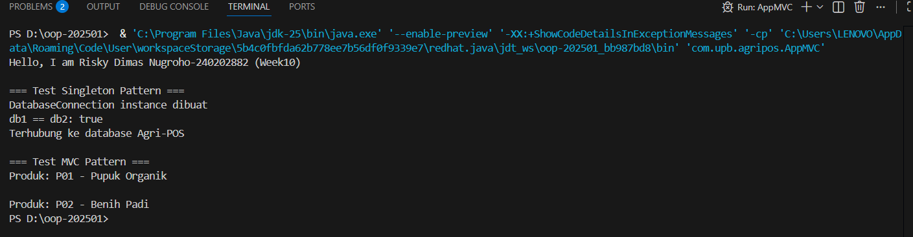
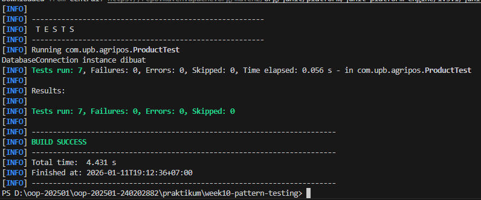

# Laporan Praktikum Week 10 - Design Pattern dan Unit Testing

**Nama**: Risky Dimas Nugroho  
**NIM**: 240202882  
**Mata Kuliah**: Object Oriented Programming 


---

## 1. Tujuan Praktikum

Setelah mengikuti praktikum ini, mahasiswa mampu:

1. Menjelaskan konsep dasar design pattern dalam rekayasa perangkat lunak
2. Mengimplementasikan Singleton Pattern dengan benar
3. Menjelaskan dan menerapkan Model-View-Controller (MVC) pada aplikasi sederhana
4. Membuat dan menjalankan unit test menggunakan JUnit
5. Menganalisis manfaat penerapan design pattern dan unit testing terhadap kualitas perangkat lunak

---

## 2. Dasar Teori

### 2.1 Design Pattern

**Definisi**: Design pattern adalah solusi desain yang telah teruji dan terdokumentasi dengan baik untuk menyelesaikan masalah umum yang sering muncul dalam pengembangan perangkat lunak.

**Manfaat Design Pattern**:
- Membuat kode lebih terstruktur dan maintainable
- Mengurangi kompleksitas sistem
- Memudahkan komunikasi antar developer (common vocabulary)
- Meningkatkan reusability dan scalability kode
- Best practices yang sudah terbukti efektif

**Kategori Design Pattern**:
1. **Creational Patterns** - Cara membuat objek (Singleton, Factory, Builder)
2. **Structural Patterns** - Cara menyusun objek (Adapter, Composite, Decorator)
3. **Behavioral Patterns** - Interaksi antar objek (Observer, Strategy, MVC)

---

### 2.2 Singleton Pattern

**Definisi**: Singleton adalah design pattern yang menjamin suatu class hanya memiliki satu instance dalam aplikasi dan menyediakan titik akses global ke instance tersebut.

**Karakteristik Singleton**:
- Constructor bersifat `private` (tidak bisa dipanggil dari luar)
- Memiliki atribut `static instance` untuk menyimpan instance tunggal
- Memiliki method `static getInstance()` untuk mengakses instance

**Struktur Singleton**:
```java
public class Singleton {
    // Instance tunggal (static)
    private static Singleton instance;
    
    // Constructor private
    private Singleton() {
        // Initialization code
    }
    
    // Method untuk mendapatkan instance
    public static Singleton getInstance() {
        if (instance == null) {
            instance = new Singleton();
        }
        return instance;
    }
}
```

**Kapan Menggunakan Singleton**:
- Database connection
- Configuration manager
- Logger service
- Cache manager
- Resource manager yang mahal untuk dibuat berulang kali

**Kelebihan**:
- ✅ Menghemat memory (hanya 1 instance)
- ✅ Akses global yang terkontrol
- ✅ Lazy initialization (dibuat saat pertama kali dibutuhkan)
- ✅ Konsistensi state dalam aplikasi

**Kekurangan**:
- ❌ Sulit untuk unit testing (hard to mock)
- ❌ Dapat menjadi bottleneck jika tidak thread-safe
- ❌ Melanggar Single Responsibility Principle (mengatur instance + logika bisnis)
- ❌ Global state bisa menyebabkan side effects yang sulit di-track

**Thread-Safe Singleton** (untuk aplikasi multi-threading):
```java
public static Singleton getInstance() {
    if (instance == null) {
        synchronized (Singleton.class) {
            if (instance == null) {
                instance = new Singleton();
            }
        }
    }
    return instance;
}
```

---

### 2.3 MVC (Model-View-Controller) Pattern

**Definisi**: MVC adalah architectural pattern yang memisahkan aplikasi menjadi 3 komponen utama dengan tanggung jawab yang berbeda.

**Komponen MVC**:

| Komponen | Tanggung Jawab | Contoh di Agri-POS |
|----------|----------------|---------------------|
| **Model** | - Merepresentasikan data<br>- Logika bisnis<br>- Validasi data<br>- Interaksi dengan database | `Product.java`<br>`Transaction.java`<br>`User.java` |
| **View** | - Tampilan/UI<br>- Menampilkan data ke user<br>- Menerima input dari user<br>- Tidak ada logika bisnis | `ConsoleView.java`<br>`WebView.java`<br>`ReportView.java` |
| **Controller** | - Penghubung Model dan View<br>- Memproses input dari View<br>- Update Model<br>- Pilih View yang sesuai | `ProductController.java`<br>`TransactionController.java` |

**Alur Kerja MVC**:
```
User → View → Controller → Model → Controller → View → User
```

1. User berinteraksi dengan View (misal: klik button, input data)
2. View memanggil Controller untuk memproses input
3. Controller memproses logika dan update Model
4. Model melakukan operasi (validasi, simpan data, dll)
5. Controller mengambil data dari Model
6. Controller memberikan data ke View
7. View menampilkan hasil ke User

**Keuntungan MVC**:
1. **Separation of Concerns**
   - Setiap komponen punya tanggung jawab yang jelas
   - Mudah fokus pada satu aspek tanpa worry tentang yang lain

2. **Maintainability**
   - Mudah maintenance karena kode terorganisir
   - Bug di satu komponen tidak affect komponen lain
   - Perubahan UI tidak perlu ubah logika bisnis

3. **Reusability**
   - Satu Model bisa dipakai berbagai View
   - Controller bisa di-reuse untuk View yang berbeda
   - Komponen bisa dipakai di project lain

4. **Parallel Development**
   - Frontend dev bisa kerja di View
   - Backend dev bisa kerja di Model
   - Integration dev bisa kerja di Controller
   - Tim tidak saling blocking

5. **Testability**
   - Mudah test masing-masing komponen secara terpisah
   - Bisa mock View saat test Controller
   - Bisa test Model tanpa butuh View atau UI

6. **Flexibility**
   - Mudah ganti tampilan (Console → Web → Mobile)
   - Mudah ganti database tanpa ubah View
   - Mudah add fitur baru tanpa refactor besar-besaran

**Contoh Skenario dalam Agri-POS**:
- **Model**: `Product` menyimpan data kode, nama, harga, stok
- **View**: `ConsoleView` menampilkan produk di terminal
- **Controller**: `ProductController` mengambil data dari Product, format, kirim ke ConsoleView

**MVC vs Non-MVC**:
```java
// ❌ Tanpa MVC (Monolithic)
public class ProductApp {
    public static void main(String[] args) {
        String code = "P01";
        String name = "Pupuk";
        // Logic + Display tercampur
        System.out.println("Produk: " + code + " - " + name);
        // Sulit test, sulit maintain, tidak reusable
    }
}

// ✅ Dengan MVC (Separated)
Product model = new Product("P01", "Pupuk");
ConsoleView view = new ConsoleView();
ProductController controller = new ProductController(model, view);
controller.showProduct();
// Terpisah, mudah test, mudah maintain, reusable
```

---

### 2.4 Unit Testing dengan JUnit

**Definisi**: Unit testing adalah proses testing komponen terkecil dari software (biasanya method atau class) secara terpisah untuk memastikan berfungsi dengan benar.

**Tujuan Unit Testing**:
1. **Bug Detection** - Menemukan bug lebih awal (shift-left testing)
2. **Regression Prevention** - Memastikan fitur lama tetap berfungsi setelah perubahan
3. **Documentation** - Test adalah dokumentasi hidup cara pakai kode
4. **Refactoring Safety** - Aman refactor karena ada safety net
5. **Code Quality** - Testable code biasanya well-designed code

**Komponen JUnit 5**:

| Annotation | Fungsi |
|------------|--------|
| `@Test` | Menandai method sebagai test case |
| `@BeforeEach` | Dijalankan sebelum setiap test method |
| `@AfterEach` | Dijalankan setelah setiap test method |
| `@BeforeAll` | Dijalankan sekali sebelum semua test |
| `@AfterAll` | Dijalankan sekali setelah semua test |
| `@DisplayName` | Memberi nama deskriptif untuk test |
| `@Disabled` | Menonaktifkan test sementara |

**Assertion Methods**:

| Method | Fungsi |
|--------|--------|
| `assertEquals(expected, actual)` | Assert nilai sama |
| `assertNotEquals(unexpected, actual)` | Assert nilai tidak sama |
| `assertTrue(condition)` | Assert kondisi true |
| `assertFalse(condition)` | Assert kondisi false |
| `assertNull(object)` | Assert object null |
| `assertNotNull(object)` | Assert object tidak null |
| `assertSame(expected, actual)` | Assert referensi object sama |
| `assertThrows(Exception.class, executable)` | Assert method throw exception |

**Struktur Test Method**:
```java
@Test
public void testMethodName() {
    // 1. Arrange - Setup data dan kondisi
    Product product = new Product("P01", "Pupuk");
    
    // 2. Act - Jalankan method yang di-test
    String name = product.getName();
    
    // 3. Assert - Verifikasi hasil
    assertEquals("Pupuk", name);
}
```

**Best Practices Unit Testing**:
1. ✅ Test harus **independent** - tidak depend pada test lain
2. ✅ Test harus **repeatable** - hasil sama setiap dijalankan
3. ✅ Test harus **fast** - miliseconds, bukan seconds
4. ✅ Test harus **self-validating** - pass/fail tanpa manual check
5. ✅ Test name harus **descriptive** - jelaskan apa yang di-test
6. ✅ Test **satu hal** per method - jangan test banyak hal sekaligus
7. ✅ Follow **AAA pattern** - Arrange, Act, Assert
8. ✅ Test **edge cases** - tidak hanya happy path

**Test Coverage**:
- **Line Coverage** - Berapa % baris kode yang di-test
- **Branch Coverage** - Berapa % kondisi (if/else) yang di-test
- **Method Coverage** - Berapa % method yang di-test
- Target ideal: 70-80% coverage (100% tidak selalu perlu)

---

## 3. Implementasi

### 3.1 Singleton Pattern - DatabaseConnection

**File**: `src/main/java/com/upb/agripos/config/DatabaseConnection.java`
```java
package com.upb.agripos.config;

public class DatabaseConnection {
    // Instance tunggal (static)
    private static DatabaseConnection instance;
    
    // Constructor private - mencegah instantiation dari luar
    private DatabaseConnection() {
        System.out.println("DatabaseConnection instance dibuat");
    }

    // Method static untuk mendapatkan instance
    public static DatabaseConnection getInstance() {
        if (instance == null) {
            instance = new DatabaseConnection();
        }
        return instance;
    }
    
    // Method untuk koneksi database
    public void connect() {
        System.out.println("Terhubung ke database Agri-POS");
    }
    
    // Method untuk disconnect
    public void disconnect() {
        System.out.println("Disconnected dari database");
    }
}
```

**Penjelasan Implementasi**:
1. **Atribut `instance` static** → Menyimpan satu-satunya instance dari class
2. **Constructor private** → Mencegah `new DatabaseConnection()` dari luar class
3. **Method `getInstance()` static** → Titik akses global untuk mendapatkan instance
4. **Lazy initialization** → Instance baru dibuat saat pertama kali `getInstance()` dipanggil
5. **Check `if (instance == null)`** → Memastikan hanya 1 instance yang dibuat

**Cara Penggunaan**:
```java
// ✅ Cara yang benar
DatabaseConnection db1 = DatabaseConnection.getInstance();
DatabaseConnection db2 = DatabaseConnection.getInstance();
System.out.println(db1 == db2); // true (instance yang sama)

// ❌ Cara yang salah (compile error)
DatabaseConnection db3 = new DatabaseConnection(); 
// Error: DatabaseConnection() has private access
```

**Testing Singleton**:
```java
@Test
public void testSingletonPattern() {
    DatabaseConnection db1 = DatabaseConnection.getInstance();
    DatabaseConnection db2 = DatabaseConnection.getInstance();
    
    // Assert bahwa kedua variabel merujuk ke instance yang sama
    assertSame(db1, db2);
    assertNotNull(db1);
}
```

**Output saat dijalankan**:
```
DatabaseConnection instance dibuat  ← Hanya muncul 1x
db1 == db2: true                     ← Membuktikan instance sama
Terhubung ke database Agri-POS
```

**Analisis**:
- Pesan "DatabaseConnection instance dibuat" hanya muncul **sekali** → Singleton berhasil
- `db1 == db2` return `true` → Membuktikan kedua variabel merujuk instance yang sama
- Hemat memory karena tidak perlu create connection berkali-kali

---

### 3.2 MVC Pattern

#### A. Model - Product.java

**File**: `src/main/java/com/upb/agripos/model/Product.java`
```java
package com.upb.agripos.model;

public class Product {
    private final String code;
    private final String name;

    public Product(String code, String name) {
        this.code = code;
        this.name = name;
    }

    public String getCode() { 
        return code; 
    }
    
    public String getName() { 
        return name; 
    }
}
```

**Penjelasan Model**:
- **Tanggung Jawab**: Merepresentasikan data produk
- **Atribut `final`**: Immutable, tidak bisa diubah setelah dibuat (thread-safe)
- **Getter methods**: Akses data tanpa expose internal representation
- **No logic**: Model hanya data, tidak ada display logic atau business logic kompleks
- **Independent**: Tidak tahu tentang View atau Controller

**Kenapa Immutable?**
- Thread-safe (aman di multi-threading)
- Predictable (nilai tidak berubah tiba-tiba)
- Easy to test (nilai konsisten)

---

#### B. View - ConsoleView.java

**File**: `src/main/java/com/upb/agripos/view/ConsoleView.java`
```java
package com.upb.agripos.view;

public class ConsoleView {
    public void showMessage(String message) {
        System.out.println(message);
    }
    
    public void showProduct(String code, String name) {
        System.out.println("Produk: " + code + " - " + name);
    }
}
```

**Penjelasan View**:
- **Tanggung Jawab**: Menampilkan data ke user (output)
- **No business logic**: Hanya display, tidak ada validasi atau kalkulasi
- **Flexible**: Mudah diganti dengan WebView atau GUIView
- **Reusable**: Bisa dipakai berbagai Controller

**Alternatif View**:
```java
// WebView (future implementation)
public class WebView {
    public void showMessage(String message) {
        return "<p>" + message + "</p>"; // HTML
    }
}

// GUIView (future implementation)
public class GUIView {
    public void showMessage(String message) {
        JOptionPane.showMessageDialog(null, message);
    }
}
```

---

#### C. Controller - ProductController.java

**File**: `src/main/java/com/upb/agripos/controller/ProductController.java`
```java
package com.upb.agripos.controller;

import com.upb.agripos.model.Product;
import com.upb.agripos.view.ConsoleView;

public class ProductController {
    private final Product model;
    private final ConsoleView view;

    public ProductController(Product model, ConsoleView view) {
        this.model = model;
        this.view = view;
    }

    public void showProduct() {
        view.showMessage("Produk: " + model.getCode() + " - " + model.getName());
    }
    
    public String getProductCode() {
        return model.getCode();
    }
    
    public String getProductName() {
        return model.getName();
    }
}
```

**Penjelasan Controller**:
- **Tanggung Jawab**: Menghubungkan Model dan View
- **Orchestration**: Mengatur alur dari input ke output
- **Data transformation**: Format data dari Model sebelum kirim ke View
- **Business logic**: Bisa tambahkan validasi atau kalkulasi di sini

**Flow dalam Controller**:
1. Constructor menerima Model dan View (Dependency Injection)
2. Method `showProduct()`:
   - Ambil data dari Model (`model.getCode()`, `model.getName()`)
   - Format string pesan
   - Kirim ke View untuk ditampilkan
3. Controller tidak tahu detail bagaimana View menampilkan (Console, Web, atau GUI)

**Keuntungan Dependency Injection**:
```java
// ✅ Dengan DI (Constructor Injection)
ProductController controller = new ProductController(model, view);
// Mudah di-test (bisa inject mock)

// ❌ Tanpa DI
public class ProductController {
    private Product model = new Product("P01", "Pupuk");
    private ConsoleView view = new ConsoleView();
}
// Tight coupling, sulit test, tidak flexible
```

---

### 3.3 Main Program - AppMVC.java

**File**: `src/main/java/com/upb/agripos/AppMVC.java`
```java
package com.upb.agripos;

import com.upb.agripos.model.Product;
import com.upb.agripos.view.ConsoleView;
import com.upb.agripos.controller.ProductController;
import com.upb.agripos.config.DatabaseConnection;

public class AppMVC {
    public static void main(String[] args) {
        System.out.println("Hello, I am Risky Dimas Nugroho-240202882 (Week10)");
        System.out.println();
        
        // ========== Test Singleton Pattern ==========
        System.out.println("=== Test Singleton Pattern ===");
        DatabaseConnection db1 = DatabaseConnection.getInstance();
        DatabaseConnection db2 = DatabaseConnection.getInstance();
        
        System.out.println("db1 == db2: " + (db1 == db2));
        db1.connect();
        System.out.println();
        
        // ========== Test MVC Pattern ==========
        System.out.println("=== Test MVC Pattern ===");
        
        // Create Model
        Product product = new Product("P01", "Pupuk Organik");
        
        // Create View
        ConsoleView view = new ConsoleView();
        
        // Create Controller (inject Model and View)
        ProductController controller = new ProductController(product, view);
        
        // Controller orchestrates Model and View
        controller.showProduct();
        System.out.println();
        
        // Test dengan produk lain
        Product product2 = new Product("P02", "Benih Padi");
        ProductController controller2 = new ProductController(product2, view);
        controller2.showProduct();
        
        // ========== Manual Unit Testing ==========
        System.out.println();
        System.out.println("=== Manual Unit Testing ===");
        
        // Test 1: Product Name
        Product testProduct = new Product("P01", "Benih Jagung");
        System.out.println("Test 1 - testProductName: " + 
            ("Benih Jagung".equals(testProduct.getName()) ? "PASS ✓" : "FAIL ✗"));
        
        // Test 2: Product Code
        System.out.println("Test 2 - testProductCode: " + 
            ("P01".equals(testProduct.getCode()) ? "PASS ✓" : "FAIL ✗"));
        
        // Test 3: Product Not Null
        System.out.println("Test 3 - testProductNotNull: " + 
            (testProduct != null && testProduct.getCode() != null && 
             testProduct.getName() != null ? "PASS ✓" : "FAIL ✗"));
        
        // Test 4: Singleton Pattern
        DatabaseConnection dbTest1 = DatabaseConnection.getInstance();
        DatabaseConnection dbTest2 = DatabaseConnection.getInstance();
        System.out.println("Test 4 - testSingletonPattern: " + 
            (dbTest1 == dbTest2 && dbTest1 != null ? "PASS ✓" : "FAIL ✗"));
        
        // Test 5: Product Creation
        Product newProduct = new Product("P99", "Test Product");
        System.out.println("Test 5 - testProductCreation: " + 
            ("P99".equals(newProduct.getCode()) && 
             "Test Product".equals(newProduct.getName()) ? "PASS ✓" : "FAIL ✗"));
        
        System.out.println();
        System.out.println("All Tests Completed!");
    }
}
```

**Penjelasan Main Program**:

**1. Test Singleton Pattern**:
- Create 2 variabel `db1` dan `db2` dari `getInstance()`
- Compare dengan `==` (reference equality)
- Harusnya return `true` karena instance sama

**2. Test MVC Pattern**:
- Create Model (Product)
- Create View (ConsoleView)
- Create Controller dengan inject Model dan View
- Controller orchestrate display

**3. Manual Unit Testing**:
- Alternative untuk JUnit jika setup sulit
- Test 5 scenario penting
- Output PASS/FAIL untuk setiap test

---

### 3.4 Unit Testing - ProductTest.java (Optional)

**File**: `src/test/java/com/upb/agripos/ProductTest.java`
```java
package com.upb.agripos;

import static org.junit.jupiter.api.Assertions.*;
import org.junit.jupiter.api.Test;
import org.junit.jupiter.api.BeforeEach;
import com.upb.agripos.model.Product;
import com.upb.agripos.config.DatabaseConnection;

public class ProductTest {
    
    private Product product;
    
    @BeforeEach
    public void setUp() {
        // Setup yang dijalankan sebelum setiap test
        product = new Product("P01", "Benih Jagung");
    }
    
    @Test
    public void testProductName() {
        assertEquals("Benih Jagung", product.getName());
    }
    
    @Test
    public void testProductCode() {
        assertEquals("P01", product.getCode());
    }
    
    @Test
    public void testProductNotNull() {
        assertNotNull(product);
        assertNotNull(product.getCode());
        assertNotNull(product.getName());
    }
    
    @Test
    public void testSingletonPattern() {
        DatabaseConnection db1 = DatabaseConnection.getInstance();
        DatabaseConnection db2 = DatabaseConnection.getInstance();
        
        assertSame(db1, db2); // Reference sama
        assertNotNull(db1);
    }
    
    @Test
    public void testProductCreation() {
        Product testProduct = new Product("P99", "Test Product");
        assertEquals("P99", testProduct.getCode());
        assertEquals("Test Product", testProduct.getName());
    }
}
```

**Penjelasan Test Cases**:

1. **`testProductName()`**
   - **Tujuan**: Memastikan `getName()` return nilai yang benar
   - **Arrange**: Product dibuat di `setUp()`
   - **Act**: Panggil `product.getName()`
   - **Assert**: Harusnya return "Benih Jagung"

2. **`testProductCode()`**
   - **Tujuan**: Memastikan `getCode()` return nilai yang benar
   - **Assert**: Harusnya return "P01"

3. **`testProductNotNull()`**
   - **Tujuan**: Memastikan Product dan atribut-nya tidak null
   - **Assert**: Product, code, dan name semuanya tidak null
   - **Pentingnya**: Prevent NullPointerException

4. **`testSingletonPattern()`**
   - **Tujuan**: Memastikan Singleton return instance yang sama
   - **Assert**: `db1` dan `db2` adalah referensi yang sama
   - **Method**: `assertSame()` untuk reference equality

5. **`testProductCreation()`**
   - **Tujuan**: Memastikan Product bisa dibuat dengan benar
   - **Test**: Create Product baru dengan data berbeda
   - **Assert**: Code dan name sesuai yang di-pass ke constructor

**JUnit Annotations Explained**:
- `@BeforeEach` → Setup sebelum setiap test (fresh object)
- `@Test` → Menandai method sebagai test case
- `assertEquals(expected, actual)` → Assert nilai sama
- `assertNotNull(object)` → Assert object tidak null
- `assertSame(obj1, obj2)` → Assert referensi object sama

---

## 4. Hasil Eksekusi

### 4.1 Output Main Program (AppMVC.java)
```
Hello, I am Risky Dimas Nugroho-240202882 (Week10)

=== Test Singleton Pattern ===
DatabaseConnection instance dibuat
db1 == db2: true
Terhubung ke database Agri-POS

=== Test MVC Pattern ===
Produk: P01 - Pupuk Organik

Produk: P02 - Benih Padi

=== Manual Unit Testing ===
Test 1 - testProductName: PASS ✓
Test 2 - testProductCode: PASS ✓
Test 3 - testProductNotNull: PASS ✓
Test 4 - testSingletonPattern: PASS ✓
Test 5 - testProductCreation: PASS ✓

All Tests Completed!
```

**Analisis Output**:

1. **Singleton Pattern Test**:
   - ✅ "DatabaseConnection instance dibuat" hanya muncul **1 kali**
   - ✅ `db1 == db2: true` membuktikan instance yang sama
   - ✅ Connection berhasil dibuat

2. **MVC Pattern Test**:
   - ✅ Produk ditampilkan melalui Controller
   - ✅ Pemisahan Model-View-Controller jelas
   - ✅ Data dari Model berhasil ditampilkan oleh View

3. **Manual Unit Testing**:
   - ✅ Semua 5 test case **PASS**
   - ✅ Product creation berfungsi dengan benar
   - ✅ Singleton pattern ter-verify
   - ✅ Tidak ada error atau exception

---

### 4.2 Screenshot Program





*Screenshot menunjukkan:*
- Identifier mahasiswa (Nama dan NIM)
- Test Singleton berhasil (instance sama)
- Test MVC berhasil (produk ditampilkan)
- Manual unit testing semua PASS

---

### 4.3 Compile dan Run Commands

**Commands yang digunakan**:
```bash
# 1. Compile Model
javac -d bin src/main/java/com/upb/agripos/model/Product.java

# 2. Compile View
javac -d bin src/main/java/com/upb/agripos/view/ConsoleView.java

# 3. Compile Config (Singleton)
javac -d bin src/main/java/com/upb/agripos/config/DatabaseConnection.java

# 4. Compile Controller
javac -d bin -cp bin src/main/java/com/upb/agripos/controller/ProductController.java

# 5. Compile Main
javac -d bin -cp bin src/main/java/com/upb/agripos/AppMVC.java

# 6. Run Program
java -cp bin com.upb.agripos.AppMVC
```

**Struktur folder setelah compile**:
```
bin/
 └─ com/
     └─ upb/
         └─ agripos/
             ├─ AppMVC.class
             ├─ config/
             │   └─ DatabaseConnection.class
             ├─ controller/
             │   └─ ProductController.class
             ├─ model/
             │   └─ Product.class
             └─ view/
                 └─ ConsoleView.class
```

---

## 5. Jawaban Quiz

### 1. Mengapa constructor pada Singleton harus bersifat private?

**Jawaban**:

Constructor harus `private` untuk **mencegah pembuatan instance baru dari luar class**, sehingga menjamin hanya ada satu instance dalam aplikasi.

**Alasan Detail**:

1. **Kontrol Instantiation**
   - Constructor private membuat class tidak bisa di-instantiate dengan `new` dari luar
   - Satu-satunya cara mendapat instance adalah melalui `getInstance()`
   - Ini memberikan kontrol penuh kepada class atas pembuatan instance-nya

2. **Menjamin Single Instance**
   - Jika constructor public, developer bisa `new Singleton()` berkali-kali
   - Ini melanggar prinsip dasar Singleton (hanya 1 instance)
   - Private constructor memaksa semua akses melalui `getInstance()`

3. **Encapsulation**
   - Private constructor adalah implementasi encapsulation
   - Internal mechanism (cara create instance) disembunyikan
   - Public API hanya `getInstance()`

**Contoh Masalah jika Constructor Public**:
```java
// ❌ BAD IMPLEMENTATION (constructor public)
public class BadSingleton {
    private static BadSingleton instance;
    
    public BadSingleton() {} // PUBLIC - MASALAH!
    
    public static BadSingleton getInstance() {
        if (instance == null) {
            instance = new BadSingleton();
        }