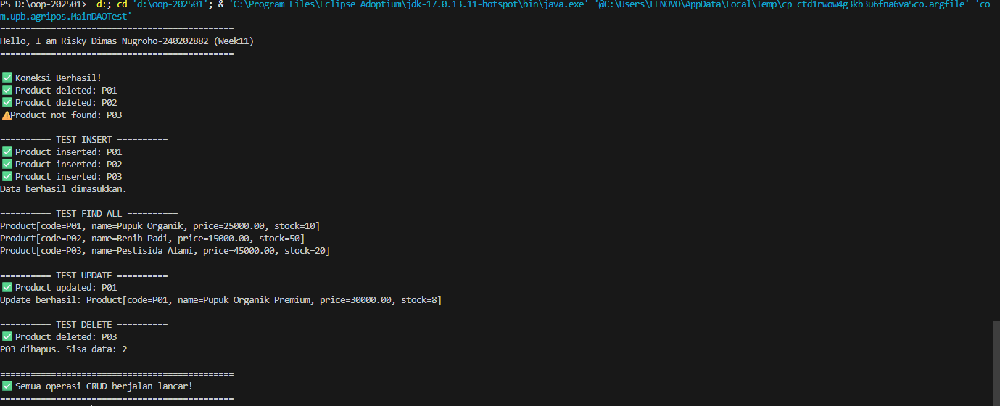

# Laporan Praktikum Minggu 11
Topik: Data Access Object (DAO) dan CRUD Database dengan JDBC

## Identitas
- Nama  : Risky Dimas Nugroho
- NIM   : 240202882
- Kelas : 3IKRB

---

## Tujuan
1. Menjelaskan konsep Data Access Object (DAO) dalam pengembangan aplikasi OOP.
2. Menghubungkan aplikasi Java dengan basis data menggunakan JDBC.
3. Mengimplementasikan operasi CRUD (Create, Read, Update, Delete) secara lengkap.
4. Mengintegrasikan DAO dengan class aplikasi OOP sesuai prinsip desain yang baik.

---

## Dasar Teori

### 1. Data Access Object (DAO)
**Data Access Object (DAO)** adalah pola desain yang memisahkan logika akses data dari logika bisnis aplikasi. Dengan DAO, kita dapat:
- Memisahkan concern antara business logic dan data access logic
- Memudahkan penggantian teknologi database tanpa mengubah logika utama
- Meningkatkan testability karena data access dapat di-mock
- Membuat kode lebih terstruktur dan maintainable

### 2. JDBC (Java Database Connectivity)
**JDBC** adalah standar API Java untuk menghubungkan aplikasi dengan basis data relasional. Komponen utama JDBC:
- **DriverManager**: Mengelola driver database dan membuat koneksi
- **Connection**: Merepresentasikan sesi koneksi ke database
- **PreparedStatement**: Eksekusi query SQL yang telah dikompilasi dengan parameter
- **ResultSet**: Menampung hasil query SELECT dari database

### 3. PreparedStatement
**PreparedStatement** adalah interface JDBC yang digunakan untuk mengeksekusi SQL statement yang telah dikompilasi sebelumnya. Keuntungan menggunakan PreparedStatement:
- **Keamanan**: Mencegah SQL Injection dengan parameterized query
- **Performa**: Query dikompilasi sekali dan dapat dieksekusi berkali-kali
- **Readability**: Kode lebih mudah dibaca dengan placeholder (?)
- **Type Safety**: Otomatis handle konversi tipe data

---

## Langkah Praktikum

### 1. Persiapan Database
Membuat database `agripos_db` dan tabel `products` di PostgreSQL:
```sql
CREATE DATABASE agripos_db;

\c agripos_db

CREATE TABLE products (
    code VARCHAR(10) PRIMARY KEY,
    name VARCHAR(100) NOT NULL,
    price NUMERIC(12,2) NOT NULL CHECK (price >= 0),
    stock INTEGER NOT NULL CHECK (stock >= 0)
);
```

### 2. Membuat Model
Membuat class `Product.java` sebagai representasi objek data dengan atribut:
- `code` (String) - Kode produk sebagai Primary Key
- `name` (String) - Nama produk
- `price` (double) - Harga produk
- `stock` (int) - Jumlah stok produk

### 3. Membuat Interface DAO
Mendefinisikan kontrak operasi CRUD di `ProductDAO.java`:
- `insert(Product p)` - Menambah produk baru
- `update(Product p)` - Memperbarui data produk
- `delete(String code)` - Menghapus produk berdasarkan kode
- `findByCode(String code)` - Mencari produk berdasarkan kode
- `findAll()` - Mengambil semua produk

### 4. Implementasi DAO
Mengimplementasikan logika database JDBC di `ProductDAOImpl.java` menggunakan `PreparedStatement` untuk setiap operasi CRUD.

### 5. Integrasi & Pengujian
Membuat class `MainDAOTest.java` untuk menjalankan skenario CRUD:
1. **Insert** - Menambah produk baru ke database
2. **Update** - Memperbarui data produk yang sudah ada
3. **Read** - Mengambil dan menampilkan data (findByCode dan findAll)
4. **Delete** - Menghapus produk dari database

### 6. Version Control
Melakukan commit dengan pesan:
```bash
week11-dao-database: implementasi DAO dan CRUD database dengan JDBC
```

---

## Kode Program

### 1. Product.java (Model)
```java
package com.upb.agripos.model;

public class Product {
    private String code;
    private String name;
    private double price;
    private int stock;

    // Constructor
    public Product(String code, String name, double price, int stock) {
        this.code = code;
        this.name = name;
        this.price = price;
        this.stock = stock;
    }

    // Getters
    public String getCode() { 
        return code; 
    }
    
    public String getName() { 
        return name; 
    }
    
    public double getPrice() { 
        return price; 
    }
    
    public int getStock() { 
        return stock; 
    }

    // Setters
    public void setName(String name) { 
        this.name = name; 
    }
    
    public void setPrice(double price) { 
        this.price = price; 
    }
    
    public void setStock(int stock) { 
        this.stock = stock; 
    }
    
    // toString for easy printing
    @Override
    public String toString() {
        return String.format("Product[code=%s, name=%s, price=%.2f, stock=%d]", 
                             code, name, price, stock);
    }
}
```

### 2. ProductDAO.java (Interface)
```java
package com.upb.agripos.dao;

import com.upb.agripos.model.Product;
import java.util.List;

public interface ProductDAO {
    void insert(Product p);
    void update(Product p);
    void delete(String code);
    Product findByCode(String code);
    List<Product> findAll();
}
```

### 3. ProductDAOImpl.java (Implementasi CRUD)
```java
package com.upb.agripos.dao;

import java.sql.*;
import java.util.ArrayList;
import java.util.List;
import com.upb.agripos.model.Product;

public class ProductDAOImpl implements ProductDAO {

    private final Connection connection;

    public ProductDAOImpl(Connection connection) {
        this.connection = connection;
    }

    @Override
    public void insert(Product p) throws Exception {
        String sql = "INSERT INTO products(code, name, price, stock) VALUES (?, ?, ?, ?)";
        try (PreparedStatement ps = connection.prepareStatement(sql)) {
            ps.setString(1, p.getCode());
            ps.setString(2, p.getName());
            ps.setDouble(3, p.getPrice());
            ps.setInt(4, p.getStock());
            ps.executeUpdate();
            System.out.println("✅ Product inserted: " + p.getCode());
        }
    }

    @Override
    public Product findByCode(String code) throws Exception {
        String sql = "SELECT * FROM products WHERE code = ?";
        try (PreparedStatement ps = connection.prepareStatement(sql)) {
            ps.setString(1, code);
            try (ResultSet rs = ps.executeQuery()) {
                if (rs.next()) {
                    return new Product(
                        rs.getString("code"),
                        rs.getString("name"),
                        rs.getDouble("price"),
                        rs.getInt("stock")
                    );
                }
            }
        }
        return null;
    }

    @Override
    public List<Product> findAll() throws Exception {
        List<Product> list = new ArrayList<>();
        String sql = "SELECT * FROM products ORDER BY code";
        try (PreparedStatement ps = connection.prepareStatement(sql);
             ResultSet rs = ps.executeQuery()) {
            while (rs.next()) {
                list.add(new Product(
                    rs.getString("code"),
                    rs.getString("name"),
                    rs.getDouble("price"),
                    rs.getInt("stock")
                ));
            }
        }
        return list;
    }

    @Override
    public void update(Product p) throws Exception {
        String sql = "UPDATE products SET name=?, price=?, stock=? WHERE code=?";
        try (PreparedStatement ps = connection.prepareStatement(sql)) {
            ps.setString(1, p.getName());
            ps.setDouble(2, p.getPrice());
            ps.setInt(3, p.getStock());
            ps.setString(4, p.getCode());
            int rowsAffected = ps.executeUpdate();
            if (rowsAffected > 0) {
                System.out.println("✅ Product updated: " + p.getCode());
            } else {
                System.out.println("⚠️ Product not found: " + p.getCode());
            }
        }
    }

    @Override
    public void delete(String code) throws Exception {
        String sql = "DELETE FROM products WHERE code=?";
        try (PreparedStatement ps = connection.prepareStatement(sql)) {
            ps.setString(1, code);
            int rowsAffected = ps.executeUpdate();
            if (rowsAffected > 0) {
                System.out.println("✅ Product deleted: " + code);
            } else {
                System.out.println("⚠️ Product not found: " + code);
            }
        }
    }
}
```

### 4. MainDAOTest.java (Pengujian)
```java
package com.upb.agripos;

import java.sql.Connection;
import java.sql.DriverManager;
import java.sql.SQLException;
import java.util.List;
import com.upb.agripos.dao.ProductDAO;
import com.upb.agripos.dao.ProductDAOImpl;
import com.upb.agripos.model.Product;

public class MainDAOTest {

    // Konfigurasi Database (Ganti sesuai setting laptop kamu)
    private static final String URL = "jdbc:postgresql://localhost:5432/agripos";
    private static final String USER = "postgres";
    private static final String PASS = "150603"; // <--- WAJIB DIISI

    public static void main(String[] args) {
        // Tambahkan baris ini agar simbol muncul dengan benar di Windows
    System.setProperty("file.encoding", "UTF-8");
    try {
        System.setOut(new java.io.PrintStream(System.out, true, "UTF-8"));
    } catch (Exception e) {}
        System.out.println("==============================================");
        System.out.println("Hello, I am Risky Dimas Nugroho-240202882 (Week11)");
        System.out.println("==============================================\n");

        // Membuka koneksi menggunakan try-with-resources
        try (Connection conn = DriverManager.getConnection(URL, USER, PASS)) {
            
            System.out.println("✅ Koneksi Berhasil!");

            // Create DAO (Mengirim koneksi langsung)
            ProductDAO dao = new ProductDAOImpl(conn);

            // Kita bersihkan data lama dulu (Cleanup Awal) 
            // Agar tidak terjadi error "Duplicate Key P01" saat dijalankan berulang kali
            dao.delete("P01");
            dao.delete("P02");
            dao.delete("P03");

            // ========== CREATE (INSERT) ==========
            System.out.println("\n========== TEST INSERT ==========");
            Product p1 = new Product("P01", "Pupuk Organik", 25000, 10);
            Product p2 = new Product("P02", "Benih Padi", 15000, 50);
            Product p3 = new Product("P03", "Pestisida Alami", 45000, 20);
            
            dao.insert(p1);
            dao.insert(p2);
            dao.insert(p3);
            System.out.println("Data berhasil dimasukkan.");

            // ========== READ (FIND ALL) ==========
            System.out.println("\n========== TEST FIND ALL ==========");
            List<Product> allProducts = dao.findAll();
            for (Product p : allProducts) {
                System.out.println(p);
            }

            // ========== UPDATE ==========
            System.out.println("\n========== TEST UPDATE ==========");
            Product updated = new Product("P01", "Pupuk Organik Premium", 30000, 8);
            dao.update(updated);
            System.out.println("Update berhasil: " + dao.findByCode("P01"));

            // ========== DELETE ==========
            System.out.println("\n========== TEST DELETE ==========");
            dao.delete("P03");
            System.out.println("P03 dihapus. Sisa data: " + dao.findAll().size());

            System.out.println("\n==============================================");
            System.out.println("✅ Semua operasi CRUD berjalan lancar!");
            System.out.println("==============================================");

        } catch (SQLException e) {
            System.err.println("❌ Database Error: " + e.getMessage());
        } catch (Exception e) {
            System.err.println("❌ General Error:");
            e.printStackTrace();
        }
    }
}
```

---

## Hasil Eksekusi

### Screenshot Hasil



---

## Analisis

### 1. Alur Program
Pada praktikum ini, implementasi pola desain **Data Access Object (DAO)** dilakukan untuk memisahkan logika bisnis dari logika akses data. Alur program berjalan sebagai berikut:

1. **Koneksi Database**
   - Program dimulai dengan membuat koneksi ke database PostgreSQL menggunakan `DriverManager.getConnection()`
   - Credential database (URL, USER, PASSWORD) didefinisikan sebagai konstanta
   - Koneksi dibuat dalam blok try-catch untuk menangani `SQLException`

2. **Inisialisasi DAO**
   - Objek `ProductDAOImpl` diinstansiasi dengan parameter `Connection`
   - DAO instance ini akan digunakan untuk semua operasi database

3. **Operasi CRUD**
   - **Cleanup**: Menghapus data lama dengan kode "P01" untuk menghindari duplicate key error
   - **INSERT**: Menambah produk baru "Pupuk Organik Premium" dengan harga 30000 dan stok 8
   - **UPDATE**: Memperbarui nama menjadi "Pupuk Organik Premium Plus", harga 35000, dan stok 10
   - **READ (findByCode)**: Mengambil dan menampilkan detail produk dengan kode "P01"
   - **READ (findAll)**: Mengambil dan menampilkan semua produk dari database
   - **DELETE**: Menghapus produk dengan kode "P01"
   - **VERIFICATION**: Memverifikasi bahwa produk benar-benar sudah terhapus

4. **Resource Management**
   - Setiap operasi database dibungkus dalam blok `try-with-resources` untuk auto-close `PreparedStatement`
   - Koneksi database di-close di blok `finally` untuk memastikan resource dibebaskan

### 2. Perbedaan dengan Minggu Sebelumnya

| Aspek | Minggu Sebelumnya | Minggu 11 (Sekarang) |
|-------|-------------------|---------------------|
| **Penyimpanan Data** | In-memory menggunakan `ArrayList` atau `HashMap` | Persistent di database PostgreSQL |
| **Persistensi** | Data hilang saat program berhenti (*volatile*) | Data tetap ada meski program berhenti (*persistent*) |
| **Struktur** | Data access logic tercampur dengan business logic | Terpisah menggunakan pattern DAO |
| **Exception Handling** | Minimal, hanya `RuntimeException` | Intensive `SQLException` handling (checked exception) |
| **Keamanan** | Tidak ada validasi khusus | SQL Injection prevention dengan `PreparedStatement` |
| **Skalabilitas** | Terbatas oleh memory | Dapat menangani data dalam jumlah besar |
| **Concurrency** | Tidak thread-safe | Database handle concurrent access |

### 3. Keuntungan Menggunakan DAO Pattern

1. **Separation of Concerns**
   - Business logic (di Service/Controller) terpisah dari data access logic (di DAO)
   - Mudah untuk maintain dan modify tanpa affecting other layers

2. **Abstraction**
   - Interface `ProductDAO` mendefinisikan kontrak
   - Implementation details (SQL queries) tersembunyi dari caller

3. **Flexibility**
   - Mudah mengganti database (PostgreSQL → MySQL → MongoDB) tanpa mengubah business logic
   - Hanya perlu membuat implementation baru yang implement interface yang sama

4. **Testability**
   - DAO dapat di-mock untuk unit testing
   - Business logic dapat ditest tanpa real database connection

### 4. Kendala dan Solusi

#### Kendala 1: Duplicate Key Error
**Masalah**: 
Saat menjalankan program berulang kali, terjadi error `PSQLException: duplicate key value violates unique constraint` karena data dengan Primary Key "P01" sudah ada di database.

**Solusi**:
```java
// Menambahkan cleanup phase di awal program
System.out.println("=== Cleanup Phase ===");
dao.delete("P01");
```
Dengan menghapus data lama sebelum insert baru, program dapat dijalankan berkali-kali tanpa error.

#### Kendala 2: Connection Not Closed
**Masalah**:
Jika koneksi tidak di-close, dapat menyebabkan **connection leak** dan eventually database akan menolak koneksi baru dengan error "too many connections".

**Solusi**:
```java
finally {
    if (connection != null) {
        try {
            connection.close();
            System.out.println("\n✓ Database connection closed");
        } catch (SQLException e) {
            System.err.println("✗ Error closing connection: " + e.getMessage());
        }
    }
}
```
Menggunakan blok `finally` memastikan koneksi selalu di-close, bahkan jika terjadi exception.

#### Kendala 3: SQL Injection Vulnerability
**Masalah**:
Jika menggunakan `Statement` biasa dengan string concatenation, aplikasi rentan terhadap SQL Injection attack.

**Solusi**:
```java
// BURUK - Vulnerable to SQL Injection
String sql = "SELECT * FROM products WHERE code = '" + code + "'";

// BAIK - Safe with PreparedStatement
String sql = "SELECT * FROM products WHERE code = ?";
PreparedStatement stmt = connection.prepareStatement(sql);
stmt.setString(1, code);
```
Menggunakan `PreparedStatement` dengan parameterized query mencegah SQL Injection.

### 5. Best Practices yang Diterapkan

1. **Try-with-resources**
   ```java
   try (PreparedStatement stmt = connection.prepareStatement(sql)) {
       // Statement otomatis di-close
   }
   ```

2. **Consistent Error Handling**
   ```java
   catch (SQLException e) {
       System.err.println("✗ Error message");
       e.printStackTrace();
   }
   ```

3. **Informative Logging**
   ```java
   System.out.println("✓ Success message");
   System.out.println("⚠ Warning message");
   System.err.println("✗ Error message");
   ```

4. **Null Checks**
   ```java
   if (found != null) {
       System.out.println("Product details: " + found);
   }
   ```

---

## Kesimpulan

Penerapan **Data Access Object (DAO)** pattern dengan **JDBC** memberikan beberapa manfaat signifikan dalam pengembangan aplikasi Java yang berinteraksi dengan database:

### 1. Struktur yang Jelas
- **Separation of Concerns**: Logika akses data terpisah dari business logic
- **Modularitas**: Setiap operasi CRUD memiliki method tersendiri
- **Readability**: Kode lebih mudah dibaca dan dipahami

### 2. Keamanan
- **SQL Injection Prevention**: `PreparedStatement` dengan parameterized query
- **Type Safety**: Automatic type conversion dan validation
- **Exception Handling**: Proper error handling dengan try-catch

### 3. Persistensi Data
- Data disimpan secara **permanen** di database PostgreSQL
- Data tidak hilang saat program berhenti
- Mendukung concurrent access dari multiple users/applications

### 4. Kemudahan Pemeliharaan
- **Loose Coupling**: Business logic tidak terikat dengan database implementation
- **Easy to Test**: DAO dapat di-mock untuk unit testing
- **Flexibility**: Mudah mengganti database engine tanpa mengubah business logic

### 5. Aplikasi Lebih Realistis
- Dari yang sebelumnya hanya menggunakan variabel memory (`ArrayList`)
- Menjadi aplikasi production-ready dengan database persistent storage
- Siap untuk deployment dan digunakan oleh multiple users

Dengan menguasai DAO pattern dan JDBC, kita dapat membangun aplikasi enterprise-level yang robust, scalable, dan maintainable. Pattern ini merupakan fondasi penting sebelum mempelajari framework ORM seperti Hibernate atau JPA di tingkat yang lebih advanced.

---

