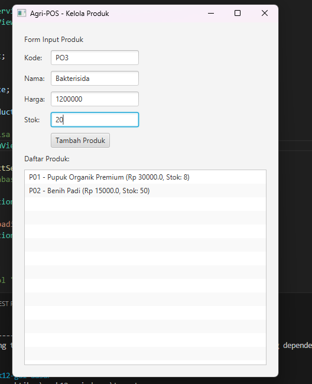

# Laporan Praktikum Minggu 12  
Topik: [GUI Dasar JavaFX (Event-Driven Programming)]

---

## Identitas

**Nama** : Risky Dimas Nugroho  
**NIM** : 240202882  
**Kelas** : 3IKRB  

---

## Tujuan

- Menjelaskan konsep event-driven programming  
- Membangun antarmuka grafis sederhana menggunakan JavaFX  
- Membuat form input data produk  
- Menampilkan daftar produk pada GUI  
- Mengintegrasikan GUI dengan modul backend (DAO & Service)

---

## Dasar Teori

### Event-Driven Programming
Paradigma pemrograman di mana alur eksekusi program ditentukan oleh event seperti klik mouse, penekanan tombol, atau input pengguna.

### JavaFX
Platform untuk membangun aplikasi desktop dan Rich Internet Application (RIA) yang bersifat cross-platform.

### MVC (Model–View–Controller)
Pola arsitektur yang memisahkan:
- **Model** → data  
- **View** → tampilan  
- **Controller** → logika aplikasi  

Tujuannya agar kode terstruktur, mudah dirawat, dan mudah dikembangkan.

### Dependency Injection
Teknik menyuntikkan dependensi (Service/DAO) ke dalam class, bukan membuatnya langsung, sehingga sistem lebih fleksibel dan mudah diuji.

---

## Langkah Praktikum

1. Setup library JavaFX pada project  
2. Membuat layout GUI (`ProductFormView`)  
3. Membuat controller (`ProductController`)  
4. Integrasi dengan `ProductService` dan `ProductDAO`  
5. Menambahkan event handler tombol **Tambah Produk**  
6. Commit repository:

---

## Kode Program

// Implementasi pada Controller untuk menangani aksi tombol
btnTambah.setOnAction(event -> {
    try {
        // Mengambil data dari TextField di form
        Product p = new Product(
             txtKode.getText(),
             txtNama.getText(),
             Double.parseDouble(txtHarga.getText()),
             Integer.parseInt(txtStok.getText())
        );
        
        // Memanggil service untuk persistensi data (Backend)
        productService.insert(p); 
        
        // Update tampilan ListView dengan format sesuai gambar
        String infoProduk = p.getKode() + " - " + p.getNama() + 
                            " (Rp " + p.getHarga() + ", Stok: " + p.getStok() + ")";
        listView.getItems().add(infoProduk);
        
        // Reset field input setelah berhasil
        clearFields();
    } catch (NumberFormatException e) {
        showAlert("Input Error", "Harga dan Stok harus berupa angka.");
    } catch (Exception e) {
        showAlert("Error", "Gagal menyimpan produk: " + e.getMessage());
    }
});

---

## Hasil Eksekusi
(Sertakan screenshot hasil eksekusi program.  

)
---

## Analisis

-Event-Driven: Aplikasi menunggu aksi klik pada tombol "Tambah Produk" sebelum mengeksekusi logika penyimpanan.
-Integrasi Backend: Penggunaan ProductService menunjukkan keberhasilan penerapan prinsip Reusability dari modul yang dibuat di minggu sebelumnya.
-Validasi Input: Penggunaan blok try-catch sangat penting untuk menangani kesalahan format angka (seperti pada field Harga dan Stok) agar aplikasi tidak crash.
-Layouting: Penggunaan komponen JavaFX standar memungkinkan pembuatan form input yang rapi dan terstruktur.

---

## Kesimpulan
Praktikum ini berhasil membuktikan bahwa penggunaan JavaFX dengan pola MVC memudahkan integrasi antara antarmuka pengguna dan logika bisnis backend. Struktur event-driven membuat aplikasi lebih interaktif dan responsif terhadap kebutuhan pengguna.
---

## Traceability Bab 6 (UML) -> GUI

| Artefak Bab 6 | Referensi | Handler GUI | Controller/Service | DAO | Dampak UI/DB |
| :--- | :--- | :--- | :--- | :--- | :--- |
| **Use Case** | UC-01 Tambah Produk | Tombol Tambah | `ProductController.add()` → `ProductService.insert()` | `ProductDAO.insert()` | UI list bertambah + DB insert |
| **Activity** | AD-01 Tambah Produk | Tombol Tambah | Validasi input & panggil service | `insert()` | Validasi → Simpan → Tampil |
| **Sequence** | SD-01 Tambah Produk | Tombol Tambah | View → Controller → Service | DAO → DB | Urutan panggilan sesuai SD |