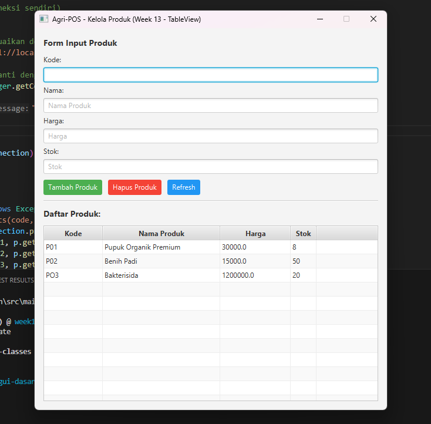

# Laporan Praktikum Minggu 12
**Topik:** GUI Dasar JavaFX (Event-Driven Programming)

## Identitas

* **Nama** : Risky Dimas Nugroho
* **NIM** : 240202882
* **Kelas** : 3IKRB

---

## Tujuan

1. Menjelaskan konsep *event-driven programming* dalam pengembangan aplikasi.
2. Membangun antarmuka grafis sederhana menggunakan library JavaFX.
3. Membuat form input data produk (Kode, Nama, Harga, Stok).
4. Menampilkan daftar produk pada komponen GUI secara dinamis.
5. Mengintegrasikan GUI dengan modul backend yang telah dibuat sebelumnya (DAO & Service).

---

## Dasar Teori

* **Event-Driven Programming**: Paradigma di mana alur eksekusi ditentukan oleh kejadian (*event*) seperti klik mouse atau input keyboard.
* **JavaFX**: Platform perangkat lunak untuk membuat aplikasi desktop Java dengan antarmuka yang kaya.
* **MVC (Model-View-Controller)**: Pola desain yang memisahkan data (Model), tampilan (View), dan logika (Controller).
* **Dependency Injection**: Teknik menyuntikkan ketergantungan objek (seperti Service) ke dalam objek yang membutuhkan.

---

## Langkah Praktikum

1. **Setup Project**: Mengonfigurasi library JavaFX pada project Maven agar dapat berjalan.
2. **Membuat Layout GUI**: Membuat class `ProductFormView` yang berisi komponen `TextField`, `Button`, dan `ListView`.
3. **Implementasi Controller**: Membuat logika untuk menangani interaksi pengguna pada tombol.
4. **Integrasi Backend**: Menghubungkan Controller dengan `ProductService` untuk penyimpanan data ke database.
5. **Event Handling**: Menambahkan listener pada tombol "Tambah Produk" untuk memicu proses input dan pembaruan UI.
6. **Commit dan Push**: Menyimpan perubahan ke repository dengan pesan commit `week12-gui-dasar`.

---

## Kode Program

Implementasi logika pada Controller menggunakan ekspresi lambda untuk menangani aksi tombol tambah:

```java
btnAdd.setOnAction(event -> {
    try {
        Product p = new Product(
             txtCode.getText(),
             txtName.getText(),
             Double.parseDouble(txtPrice.getText()),
             Integer.parseInt(txtStock.getText())
        );
        productService.insert(p); 
        listView.getItems().add(p.getCode() + " - " + p.getName() + " (Rp " + p.getPrice() + ", Stok: " + p.getStock() + ")");
        clearFields();
    } catch (NumberFormatException e) {
        showAlert("Input Error", "Harga dan Stok harus berupa angka.");
    } catch (Exception e) {
        showAlert("Error", "Gagal menyimpan produk: " + e.getMessage());
    }
});

```

---

## Hasil Eksekusi

(Sertakan screenshot hasil eksekusi program.  

)
---
Berdasarkan aplikasi **Agri-POS - Kelola Produk**, sistem berhasil menampilkan data berikut:

* **Produk P01**: Pupuk Organik Premium (Rp 30000.0, Stok: 8).
* **Produk P02**: Benih Padi (Rp 15000.0, Stok: 50).
* **Input Aktif**: Kode "PO3", Nama "Bakterisida", Harga "1200000", Stok "20".

---

## Analisis

* **Mekanisme Event**: Aplikasi menunggu tindakan pengguna (klik tombol) untuk menjalankan logika, bukan berjalan linear dari atas ke bawah.
* **Integrasi Modular**: GUI berhasil menggunakan kembali (*reusability*) logika bisnis dari `ProductService` dan `ProductDAO`.
* **Validasi**: Penanganan error dengan *try-catch* diperlukan untuk mencegah aplikasi *crash* jika pengguna salah memasukkan tipe data angka.
* **Kendala**: Tantangan utama adalah memastikan tata letak GUI tetap rapi dan sinkron dengan data di database.

---

## Kesimpulan

Praktikum ini berhasil mendemonstrasikan pembuatan GUI JavaFX yang terintegrasi dengan backend. Penggunaan pola MVC dan paradigma *event-driven* membuat aplikasi lebih interaktif dan kode program tetap terorganisir dengan baik.

---

## Traceability Bab 6 (UML) -> GUI

| Artefak Bab 6 | Referensi | Handler GUI | Controller/Service | DAO | Dampak UI/DB |
| --- | --- | --- | --- | --- | --- |
| **Use Case** | UC-01 Tambah Produk | Tombol Tambah | `ProductController.add()` → `ProductService.insert()` | `ProductDAO.insert()` | UI list bertambah + DB insert |
| **Activity** | AD-01 Tambah Produk | Tombol Tambah | Validasi input & panggil service | `insert()` | Validasi → Simpan → Tampil |
| **Sequence** | SD-01 Tambah Produk | Tombol Tambah | View → Controller → Service | DAO → DB | Urutan panggilan sesuai SD |

---

