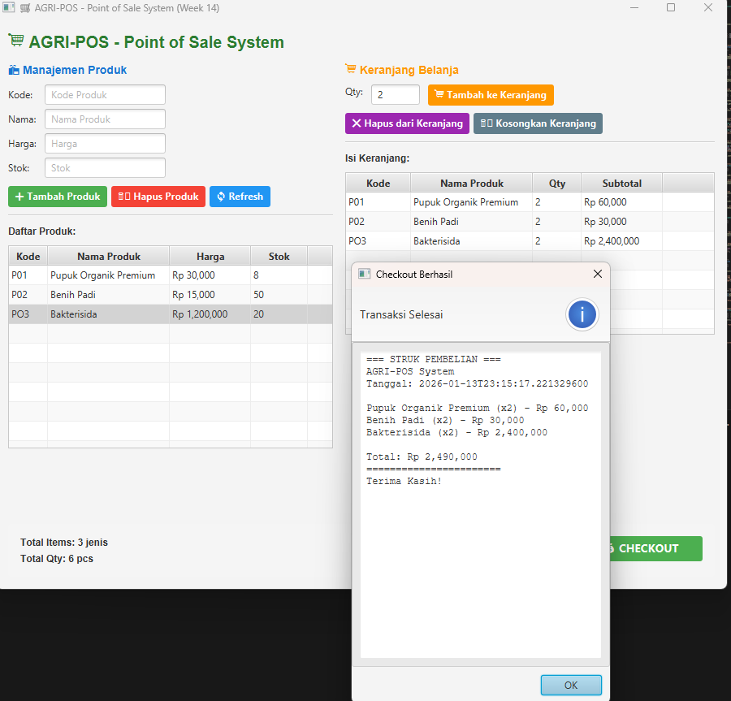

# Laporan Praktikum Minggu 14
**Topik:** Implementasi Point of Sale (POS) Berbasis JavaFX dengan Arsitektur MVC

---

## Identitas

- **Nama**  : Risky Dimas Nugroho  
- **NIM**   : 240202882  
- **Kelas** : 3IKRB  

---

## Tujuan

1. Mengimplementasikan aplikasi Point of Sale (POS) berbasis JavaFX.
2. Menerapkan konsep arsitektur MVC (Model–View–Controller).
3. Mengelola data produk (tambah, hapus, tampil).
4. Mengelola keranjang belanja dan proses checkout.
5. Menampilkan struk pembelian secara otomatis setelah transaksi selesai.

---

## Dasar Teori

1. **JavaFX** adalah library Java untuk membangun antarmuka grafis desktop yang interaktif.
2. **Point of Sale (POS)** merupakan sistem untuk mengelola transaksi penjualan secara digital.
3. **MVC (Model–View–Controller)** memisahkan logika bisnis, tampilan, dan pengontrol aplikasi.
4. **Event Handling** digunakan untuk menangani aksi pengguna seperti klik tombol.
5. **Object-Oriented Programming (OOP)** digunakan untuk memodelkan produk, keranjang, dan transaksi.

---

## Langkah Praktikum

1. Membuat project JavaFX dengan struktur MVC.
2. Membuat class `Product`, `CartItem`, dan service untuk pengolahan data.
3. Membuat tampilan GUI menggunakan `TableView`, `TextField`, dan `Button`.
4. Mengimplementasikan fitur:
   - Tambah produk
   - Hapus produk
   - Tambah ke keranjang
   - Hapus item keranjang
   - Kosongkan keranjang
   - Checkout
5. Menambahkan tampilan struk pembelian menggunakan dialog JavaFX.
6. Menjalankan aplikasi dan melakukan pengujian transaksi.
7. Melakukan commit dengan pesan: `week14-pos-system`.

---

## Kode Program

### Main Application (`AppJavaFX.java`)

```java
public class AppJavaFX extends Application {

    @Override
    public void start(Stage stage) {
        System.out.println("Hello World, I am Risky Dimas Nugroho-240202882");

        PosView view = new PosView();
        PosController controller = new PosController(view);

        Scene scene = new Scene(view, 1100, 650);
        stage.setTitle("AGRI-POS - Point of Sale System (Week 14)");
        stage.setScene(scene);
        stage.show();
    }

    public static void main(String[] args) {
        launch(args);
    }
}
````

---

### Proses Checkout (Controller)

```java
private void showReceipt() {
    StringBuilder receipt = new StringBuilder();

    receipt.append("=== STRUK PEMBELIAN ===\n");
    receipt.append("AGRI-POS System\n");
    receipt.append("Tanggal: ").append(LocalDateTime.now()).append("\n\n");

    for (CartItem item : cartService.getItems()) {
        receipt.append(item.getProduct().getName())
               .append(" (x").append(item.getQuantity()).append(") - Rp ")
               .append(String.format("%,.0f", item.getSubtotal()))
               .append("\n");
    }

    receipt.append("\nTotal: Rp ")
           .append(String.format("%,.0f", cartService.getTotal()))
           .append("\n=====================\n");
    receipt.append("Terima Kasih!");

    Alert alert = new Alert(Alert.AlertType.INFORMATION);
    alert.setTitle("Checkout Berhasil");
    alert.setHeaderText("Transaksi Selesai");
    alert.setContentText(receipt.toString());
    alert.showAndWait();
}
```

---

## Hasil Eksekusi

Aplikasi berhasil menampilkan:

* Data produk:

  * P01 – Pupuk Organik Premium – Rp 30.000 – Stok 8
  * P02 – Benih Padi – Rp 15.000 – Stok 50
  * P03 – Bakterisida – Rp 1.200.000 – Stok 20

* Keranjang belanja:

  * Pupuk Organik Premium (2)
  * Benih Padi (2)
  * Bakterisida (2)

* Total transaksi: **Rp 2.490.000**

* Struk transaksi otomatis ditampilkan setelah checkout.

```text
=== STRUK PEMBELIAN ===
AGRI-POS System
Tanggal: 2026-01-13 23:15:17

Pupuk Organik Premium (x2) - Rp 60,000
Benih Padi (x2) - Rp 30,000
Bakterisida (x2) - Rp 2,400,000

Total: Rp 2,490,000
=====================
Terima Kasih!
```

Screenshot:

```

```

---

## Analisis

* Aplikasi berjalan dengan pendekatan event-driven, di mana setiap tombol memiliki handler sendiri.
* Arsitektur MVC membuat kode lebih terstruktur dan mudah dikembangkan.
* Data produk dan keranjang diproses melalui service sehingga tidak langsung bergantung pada tampilan.
* Proses checkout menghitung subtotal dan total secara otomatis.
* Kendala utama adalah sinkronisasi data TableView dengan keranjang, yang diselesaikan dengan refresh data setelah setiap perubahan.

---

## Kesimpulan

Praktikum minggu ke-14 berhasil mengimplementasikan sistem Point of Sale berbasis JavaFX yang lengkap dengan manajemen produk, keranjang belanja, dan fitur checkout. Penerapan MVC membuat aplikasi lebih modular, mudah dirawat, dan siap dikembangkan lebih lanjut.

---

## Quiz

1. Apa fungsi arsitektur MVC dalam aplikasi POS?
   **Jawaban:** Memisahkan logika bisnis, tampilan, dan pengontrol agar kode lebih terstruktur dan mudah dikembangkan.

2. Mengapa JavaFX cocok digunakan untuk aplikasi desktop POS?
   **Jawaban:** Karena mendukung komponen GUI lengkap, event handling, dan tampilan modern.

3. Apa manfaat penggunaan keranjang belanja dalam sistem POS?
   **Jawaban:** Untuk mengelola item transaksi sebelum checkout dan menghitung total harga secara otomatis.

---

