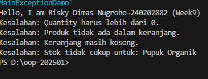

# Laporan Praktikum Week 9 - Exception Handling dan Custom Exception

**Nama**: Risky Dimas Nugroho  
**NIM**: 240202882  
**Mata Kuliah**: Pemrograman Berorientasi Objek  
**Tanggal**: [Tanggal Anda Mengerjakan]

---

## 1. Tujuan Praktikum

- Memahami perbedaan antara error dan exception
- Mengimplementasikan try-catch-finally dengan tepat
- Membuat custom exception sesuai kebutuhan program
- Mengintegrasikan exception handling ke dalam aplikasi keranjang belanja

---

## 2. Dasar Teori

### 2.1 Error vs Exception

**Error**:
- Kondisi fatal yang tidak dapat ditangani program
- Biasanya terkait masalah sistem (memory, stack overflow)
- Contoh: OutOfMemoryError, StackOverflowError
- Program harus berhenti

**Exception**:
- Kondisi tidak normal yang dapat ditangani
- Dapat diantisipasi menggunakan try-catch
- Contoh: InvalidQuantityException, FileNotFoundException
- Program dapat melanjutkan eksekusi

### 2.2 Struktur Try-Catch-Finally
```java
try {
    // Kode yang berpotensi error
} catch (Exception e) {
    // Penanganan exception
} finally {
    // Cleanup code (selalu dijalankan)
}
```

### 2.3 Custom Exception

Custom exception dibuat dengan meng-extends class Exception untuk memberikan pesan error yang lebih spesifik sesuai konteks bisnis aplikasi.

---

## 3. Implementasi

### 3.1 Custom Exception Classes

#### InvalidQuantityException.java
```java
package com.upb.agripos;

public class InvalidQuantityException extends Exception {
    public InvalidQuantityException(String msg) { 
        super(msg); 
    }
}
```
**Kegunaan**: Validasi quantity pembelian harus lebih dari 0.

---

#### ProductNotFoundException.java
```java
package com.upb.agripos;

public class ProductNotFoundException extends Exception {
    public ProductNotFoundException(String msg) { 
        super(msg); 
    }
}
```
**Kegunaan**: Validasi produk harus ada di keranjang sebelum dihapus.

---

#### InsufficientStockException.java
```java
package com.upb.agripos;

public class InsufficientStockException extends Exception {
    public InsufficientStockException(String msg) { 
        super(msg); 
    }
}
```
**Kegunaan**: Validasi stok mencukupi saat checkout.

---

#### EmptyCartException.java
```java
package com.upb.agripos;

public class EmptyCartException extends Exception {
    public EmptyCartException(String msg) { 
        super(msg); 
    }
}
```
**Kegunaan**: Validasi keranjang tidak boleh kosong saat checkout.

---

### 3.2 Model Product dengan Stok
```java
package com.upb.agripos;

public class Product {
    private final String code;
    private final String name;
    private final double price;
    private int stock;

    public Product(String code, String name, double price, int stock) {
        this.code = code;
        this.name = name;
        this.price = price;
        this.stock = stock;
    }

    public String getCode() { return code; }
    public String getName() { return name; }
    public double getPrice() { return price; }
    public int getStock() { return stock; }
    public void reduceStock(int qty) { this.stock -= qty; }
}
```

**Penjelasan**: Class Product sekarang memiliki atribut stock untuk tracking ketersediaan barang dan method reduceStock() untuk mengurangi stok saat checkout berhasil.

---

### 3.3 ShoppingCart dengan Exception Handling
```java
package com.upb.agripos;

import java.util.HashMap;
import java.util.Map;

public class ShoppingCart {
    private final Map<Product, Integer> items = new HashMap<>();

    public void addProduct(Product p, int qty) throws InvalidQuantityException {
        if (qty <= 0) {
            throw new InvalidQuantityException("Quantity harus lebih dari 0.");
        }
        items.put(p, items.getOrDefault(p, 0) + qty);
    }

    public void removeProduct(Product p) throws ProductNotFoundException {
        if (!items.containsKey(p)) {
            throw new ProductNotFoundException("Produk tidak ada dalam keranjang.");
        }
        items.remove(p);
    }

    public void checkout() throws EmptyCartException, InsufficientStockException {
        if (items.isEmpty()) {
            throw new EmptyCartException("Keranjang masih kosong.");
        }
        
        for (Map.Entry<Product, Integer> entry : items.entrySet()) {
            Product product = entry.getKey();
            int qty = entry.getValue();
            if (product.getStock() < qty) {
                throw new InsufficientStockException(
                    "Stok tidak cukup untuk: " + product.getName()
                );
            }
        }
        
        for (Map.Entry<Product, Integer> entry : items.entrySet()) {
            entry.getKey().reduceStock(entry.getValue());
        }
        
        System.out.println("Checkout berhasil!");
    }
}
```

**Penjelasan Validasi**:
1. `addProduct()` → Validasi quantity harus > 0
2. `removeProduct()` → Validasi produk harus ada di keranjang
3. `checkout()` → Validasi keranjang tidak kosong dan stok mencukupi

---

### 3.4 Main Program
```java
package com.upb.agripos;

public class MainExceptionDemo {
    public static void main(String[] args) {
        System.out.println("Hello, I am Risky Dimas Nugroho-240202882 (Week9)");

        ShoppingCart cart = new ShoppingCart();
        Product p1 = new Product("P01", "Pupuk Organik", 25000, 3);

        // Test 1: Quantity invalid
        try {
            cart.addProduct(p1, -1);
        } catch (InvalidQuantityException e) {
            System.out.println("Kesalahan: " + e.getMessage());
        }

        // Test 2: Hapus produk yang tidak ada
        try {
            cart.removeProduct(p1);
        } catch (ProductNotFoundException e) {
            System.out.println("Kesalahan: " + e.getMessage());
        }

        // Test 3: Checkout keranjang kosong
        try {
            cart.checkout();
        } catch (EmptyCartException | InsufficientStockException e) {
            System.out.println("Kesalahan: " + e.getMessage());
        }

        // Test 4: Stok tidak cukup
        try {
            cart.addProduct(p1, 5);
            cart.checkout();
        } catch (Exception e) {
            System.out.println("Kesalahan: " + e.getMessage());
        }
    }
}
```

---

## 4. Hasil Eksekusi



**Output Program:**
```
Hello, I am Risky Dimas Nugroho-240202882 (Week9)
Kesalahan: Quantity harus lebih dari 0.
Kesalahan: Produk tidak ada dalam keranjang.
Kesalahan: Keranjang masih kosong.
Kesalahan: Stok tidak cukup untuk: Pupuk Organik
```

**Penjelasan Output:**
1. **Test 1**: Mencoba tambah produk dengan quantity -1 → InvalidQuantityException
2. **Test 2**: Mencoba hapus produk yang belum ada → ProductNotFoundException
3. **Test 3**: Mencoba checkout keranjang kosong → EmptyCartException
4. **Test 4**: Mencoba checkout dengan quantity melebihi stok → InsufficientStockException

---

## 5. Jawaban Quiz

### 1. Jelaskan perbedaan error dan exception

| Aspek | Error | Exception |
|-------|-------|-----------|
| **Definisi** | Kondisi fatal yang tidak dapat ditangani | Kondisi tidak normal yang dapat ditangani |
| **Penyebab** | Masalah sistem/JVM | Kesalahan logika/input |
| **Handling** | ❌ Tidak bisa ditangani | ✅ Bisa dengan try-catch |
| **Contoh** | OutOfMemoryError | InvalidQuantityException |
| **Parent Class** | java.lang.Error | java.lang.Exception |

**Kesimpulan**: Error adalah masalah fatal sistem yang tidak dapat ditangani program, sedangkan Exception adalah kondisi tidak normal yang dapat diantisipasi dan ditangani dengan try-catch block.

---

### 2. Apa fungsi finally dalam blok try–catch–finally?

Finally adalah blok yang **selalu dijalankan** terlepas apakah terjadi exception atau tidak.

**Kegunaan**:
- Cleanup operations (menutup file, koneksi database)
- Memastikan resource dilepas dengan benar
- Logging atau pencatatan aktivitas

**Contoh**:
```java
FileWriter writer = null;
try {
    writer = new FileWriter("data.txt");
    writer.write("Hello");
} catch (IOException e) {
    System.out.println("Error: " + e.getMessage());
} finally {
    // Blok ini PASTI dijalankan
    if (writer != null) {
        try {
            writer.close();
        } catch (IOException e) {
            e.printStackTrace();
        }
    }
}
```

**Urutan Eksekusi**:
1. Try → jalankan kode
2. Catch → handle exception (jika ada)
3. Finally → **SELALU dijalankan** (cleanup)

---

### 3. Mengapa custom exception diperlukan?

**Alasan Custom Exception Penting**:

1. **Pesan Error Lebih Spesifik**
   - Built-in exception terlalu umum
   - Custom exception sesuai konteks bisnis
```java
   // ❌ Kurang jelas
   throw new Exception("Error");
   
   // ✅ Jelas dan informatif
   throw new InvalidQuantityException("Quantity harus lebih dari 0.");
```

2. **Memisahkan Jenis Kesalahan**
   - Mudah menangani berbagai kasus secara spesifik
```java
   try {
       cart.checkout();
   } catch (EmptyCartException e) {
       // Handle keranjang kosong
   } catch (InsufficientStockException e) {
       // Handle stok tidak cukup
   }
```

3. **Kode Lebih Maintainable**
   - Developer lain mudah memahami
   - Self-documenting code
   - Mudah debugging

4. **Sesuai Domain Bisnis**
   - Nama exception mencerminkan masalah bisnis
   - Lebih profesional dan terstruktur

---

### 4. Berikan contoh kasus bisnis dalam POS yang membutuhkan custom exception

**Contoh Custom Exception untuk Sistem Agri-POS**:

#### a. PaymentInsufficientException
```java
public class PaymentInsufficientException extends Exception {
    public PaymentInsufficientException(double required, double paid) {
        super("Pembayaran kurang! Total: Rp" + required + 
              ", Dibayar: Rp" + paid);
    }
}
```
**Kasus**: Pelanggan bayar Rp 50.000 tapi total belanja Rp 75.000

---

#### b. ExpiredProductException
```java
public class ExpiredProductException extends Exception {
    public ExpiredProductException(String productName, String expDate) {
        super("Produk " + productName + " sudah kadaluarsa sejak " + expDate);
    }
}
```
**Kasus**: Kasir mencoba scan produk yang sudah expired

---

#### c. InvalidDiscountException
```java
public class InvalidDiscountException extends Exception {
    public InvalidDiscountException(String message) {
        super(message);
    }
}
```
**Kasus**: 
- Kode voucher tidak valid
- Diskon > 100%
- Voucher sudah expired

---

#### d. UnauthorizedAccessException
```java
public class UnauthorizedAccessException extends Exception {
    public UnauthorizedAccessException(String action) {
        super("Anda tidak memiliki akses untuk: " + action);
    }
}
```
**Kasus**: Kasir biasa mencoba akses fitur manager (hapus transaksi, lihat laporan keuangan)

---

#### e. DuplicateTransactionException
```java
public class DuplicateTransactionException extends Exception {
    public DuplicateTransactionException(String transactionId) {
        super("Transaksi " + transactionId + " sudah pernah diproses");
    }
}
```
**Kasus**: Mencegah double-payment untuk transaksi yang sama

---

**Implementasi Contoh**:
```java
public void processPayment(double total, double paid) 
    throws PaymentInsufficientException {
    
    if (paid < total) {
        throw new PaymentInsufficientException(total, paid);
    }
    
    double change = paid - total;
    System.out.println("Pembayaran berhasil!");
    System.out.println("Kembalian: Rp" + change);
}
```

---

## 6. Analisis

### 6.1 Keuntungan Exception Handling

1. **Program Lebih Robust**
   - Tidak crash saat ada error
   - Memberikan feedback yang jelas ke user

2. **Maintainability Tinggi**
   - Mudah tracking bug
   - Error message informatif

3. **User Experience Lebih Baik**
   - User tahu apa yang salah
   - Dapat memperbaiki input dengan benar

### 6.2 Best Practices

1. **Jangan catch exception generic**
```java
   // ❌ Hindari
   catch (Exception e) {}
   
   // ✅ Lebih spesifik
   catch (InvalidQuantityException e) {}
```

2. **Berikan pesan error yang jelas**
```java
   // ❌ Kurang informatif
   throw new Exception("Error");
   
   // ✅ Jelas dan actionable
   throw new InvalidQuantityException("Quantity harus lebih dari 0");
```

3. **Gunakan finally untuk cleanup**
```java
   finally {
       if (connection != null) {
           connection.close();
       }
   }
```

### 6.3 Penerapan dalam Agri-POS

Dalam sistem Agri-POS, exception handling sangat penting untuk:
- Validasi input user (quantity, harga, diskon)
- Manajemen stok (cegah overselling)
- Keamanan transaksi (cegah duplikasi, validasi pembayaran)
- User experience yang baik (pesan error jelas)

---

## 7. Kesimpulan

1. Exception handling membuat program lebih robust dan user-friendly
2. Custom exception memberikan pesan error yang spesifik sesuai konteks bisnis
3. Try-catch-finally memastikan resource management yang baik
4. Validasi input dengan exception mencegah data invalid masuk ke sistem
5. Penerapan exception handling pada Agri-POS meningkatkan keandalan sistem POS

---

## 8. Referensi

- Modul Praktikum Week 9 - Exception Handling dan Custom Exception
- Oracle Java Documentation - Exception Handling
- Oracle Java Documentation - Creating Custom Exceptions